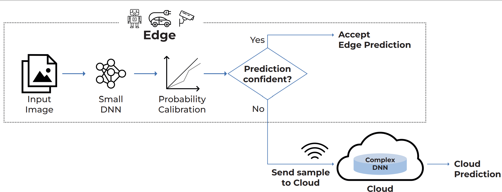

# EdgeBoost: Confidence Boosting for Resource Constrained Inference via Selective Offloading

Welcome to EdgeBoost's repository. This repository contains the code for the work presented in the paper titled "EdgeBoost: Confidence Boosting for Resource Constrained Inference via Selective Offloading"

## About EdgeBoost

EdgeBoost is a selective input offloading system designed to overcome the challenges of limited
computational resources on edge devices. EdgeBoost trains and calibrates a lightweight model for deployment on the edge and, in addition, deploys a large, complex model on the cloud. During inference, the edge model makes initial predictions for input samples, and if the confidence of the prediction is low, the sample is sent to the cloud model for further processing otherwise, we accept the local prediction.



## Installation Instructions

Follow these instructions to set up the required Python environment for running EdgeBoost. Make sure you have the following prerequisites installed on your system:

- [Python](https://www.python.org/downloads/) (Python 3.x recommended)
- [pip](https://pip.pypa.io/en/stable/installation/) (Python package manager)
- [virtualenv](https://virtualenv.pypa.io/en/latest/installation.html) (Python environment creator)
### Installation

1. Clone this Git repository to your local machine using the following command:

   ```bash
   git clone https://github.com/ds-kiel/EdgeBoost
   cd EdgeBoost
   ```
2. Create a virtual Python environment to isolate the project dependencies. You can do this using venv if you're using Python 3.3 or newer, or virtualenv if you're using an older version of Python. Replace <env_name> with your preferred environment name:

    ```bash
    virtualenv edgeboost
    source edgeboost/bin/activate
    ``` 
3. Install the necessary Python packages by running:

   ```bash
   pip install -r requirements.txt
   ```


## Usage

### Train the Models

To train the edge/cloud model, use train.py. This repo trains MobileNetV3 Small (as edge model) and EfficientV2L(as cloud model) on CIFAR-100 dataset. But the same can be used for other datasets or models

To train a model from scratch, execute the following command:

```bash
python train.py --model_name <model_name> --data_dir <path_to_data>
```
Replace <model_name> with mobilenet_v3 or efficientnet_v2_l and <path_to_data> to store the CIFAR-100 dataset. After training, the models are saved <model_name>.pth.

### Model Evaluation

After training your models with `train.py`, you can evaluate their performance using the `evaluate.py` script. This evaluation will output the accuracy of the chosen model on the CIFAR100 test dataset and will calculate the Expected Calibration Error (ECE).

### Usage

To evaluate a model, run the `evaluate.py` script with the required arguments:

- `--model_name`: Name of the model you wish to evaluate. Choices are `mobilenet_v3` or `efficientnet_v2_l`.
- `--model_path`: Path to the saved weights of the trained model.
- `--data_dir`: Directory path for the CIFAR100 dataset.

Example command

```bash
python evaluate.py --model_name mobilenet_v3 --model_path path/to/mobilenet_v3_cifar100.pth --data_dir ./data
```


